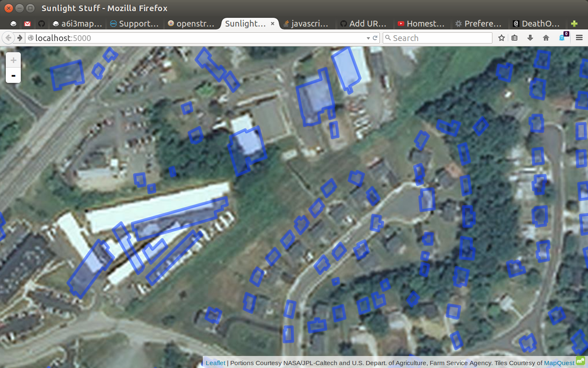

# Sunlight

This project displays a map with clickable regions that correspond to rooftops.
When things are clicked, tons of useful info gets spat out.

Ex.:

As you can see, it's in development.

The blue regions should correspond with the rooftops; you can click the and see little popups with tables in them, which look a little like this:

    Building Area:        19375.7 m2
    Useable Build Area:   13272 m2
    Percent Useable:      68%
    Expected Output:      1617230 kWh
    System Size:          197.184 kW
    Expected Savings:     $21690.24
    Rooftop ID:           4718

It also has a form at /import to load shapefiles to the database, and a form at /setpass to change the password that protects the aforementioned /import form.

A PostgreSQL database with PostGIS installed is required. You can get both with `apt-get install postgresql postgis`. After this, a database must be created for Sunlight to use. Run the [init.sql](init.sql) file on the database, and change the contents of [flaskconfig.py](flaskconfig.py) as needed.

For a full overview of the app's design, see [documentation.txt](documentation.txt).
